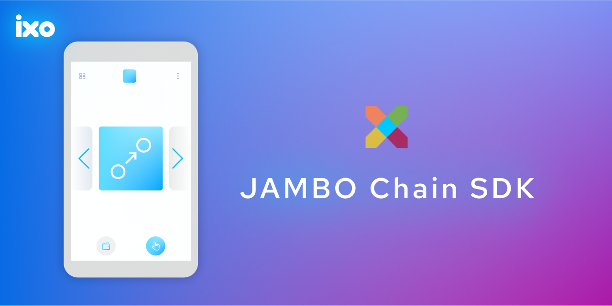

# COSMOS CHAIN RESOLVER 🔗


<p align="center">
  
</p>

<br />

<h2 align="center">
    An SDK to fetch and filter chain information
</h2>

<br />

This repo and product is intentionally managed as Open Source and we aim to use this guide to light our way https://opensource.guide/.
Let us know how we are doing!

## 🔨 Install

```sh
npm install @ixo/cosmos-chain-resolver

yarn add  @ixo/cosmos-chain-resolver
```

## 💻 Usage

To use the Cosmos Chain Resolver, you can import the function(s) you want to use and execute it with the appropriate parameters.

```js
import {
	getRegistryChainInfo,
	getActiveRpcFromRegistryChainInfo,
	getActiveRpcFromChainName,
	getChainExplorer,
	getChainExplorerAsync,
	getKeplrChainInfoFromRegistryChainInfo,
	getKeplrChainInfo,
} from '@ixo/cosmos-chain-resolver';
```

The Cosmos Chain Resolver SDK expose the following functions:

### getRegistryChainInfo

```ts
getRegistryChainInfo(chainName: string, chainNetwork?: ChainNetwork): Promise<RegistryChainInfo>
```

This function fetches the chain info for the provided chainName and chainNetwork. If chainNetwork is not provided, it defaults to mainnet.

### getActiveRpcFromRegistryChainInfo

```ts
getActiveRpcFromRegistryChainInfo(chainInfo: RegistryChainInfo): Promise<string>
```

This function filters through and fetches an active RPC endpoint from the provided chainInfo.

### getActiveRpcFromChainName

```ts
getActiveRpcFromChainName(chainName: string, chainNetwork?: ChainNetwork): Promise<string>
```

This function fetches an active RPC endpoint for the provided chainName and chainNetwork. If chainNetwork is not provided, it defaults to mainnet.

### getChainExplorer

```ts
getChainExplorer(chainName: string, chainNetwork: ChainNetwork, chainExplorers?: ChainExplorer[]): KeplrChainExplorer | undefined
```

This function fetches the tx explorer info for the provided chainName, chainNetwork and chainExplorers.

### getChainExplorerAsync

```ts
getChainExplorerAsync(chainName: string, chainNetwork: ChainNetwork): Promise<KeplrChainExplorer | undefined>
```

This function fetches the tx explorer info for the provided chainName and chainNetwork via the Cosmos Chain Registry.

### getKeplrChainInfoFromRegistryChainInfo

```ts
getKeplrChainInfoFromRegistryChainInfo(chainInfo: RegistryChainInfo): Promise<KeplrChainInfo>
```

This function fetches the keplr chain info for the provided chainInfo.

### getKeplrChainInfo

```ts
getKeplrChainInfo(chainNameOrId: string, chainNetwork: ChainNetwork = MAINNET, ): Promise<KeplrChainInfo>
```

This function fetches the keplr chain info for the provided chain id or the chain name-and-network.

## 📱 Example

```ts
import { getKeplrChainInfo } from '@ixo/cosmos-chain-resolver';

// fetch chain info via chain id
const ixoKeplrChainInfo = await getKeplrChainInfo('ixo-5');

// fetch chain info via chain name and network
const ixoTestnetKeplrChainInfo = await getKeplrChainInfo('impacthub', 'testnet');
```

```ts
import { getRegistryChainInfo, getKeplrChainInfoFromRegistryChainInfo } from '@ixo/cosmos-chain-resolver';

// fetch chain info via chain id
const ixoRegistryChainInfo = await getRegistryChainInfo('impacthub', 'mainnet');

// fetch chain info via chain name and network
const ixoKeplrChainInfo = await getKeplrChainInfoFromRegistryChainInfo(ixoRegistryChainInfo);
```

## 📃 License

This SDK is licensed under the Apache 2 License. See the [LICENSE](/LICENSE) file for more information.
